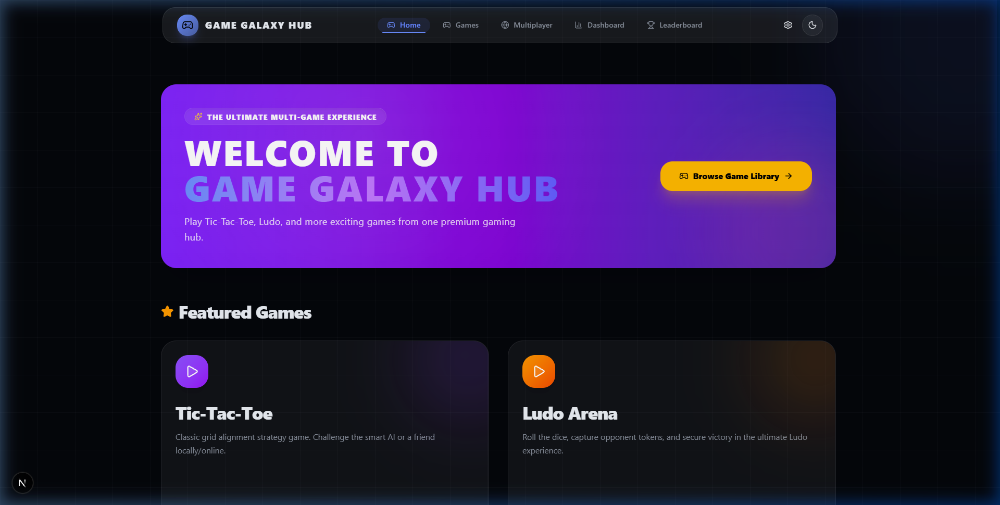
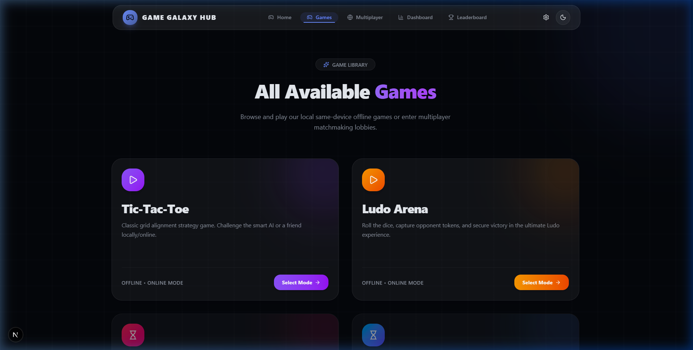
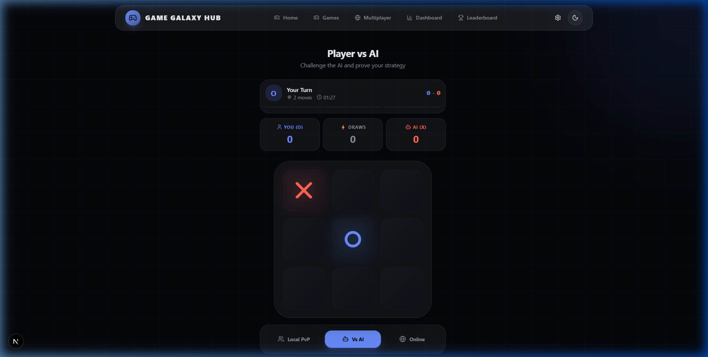
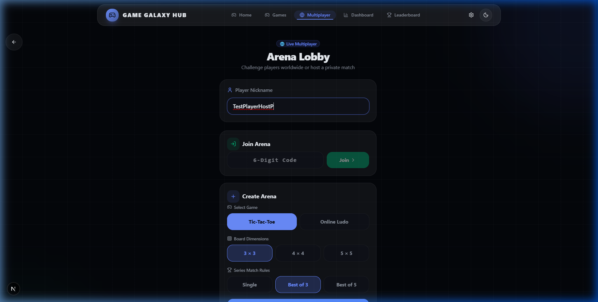
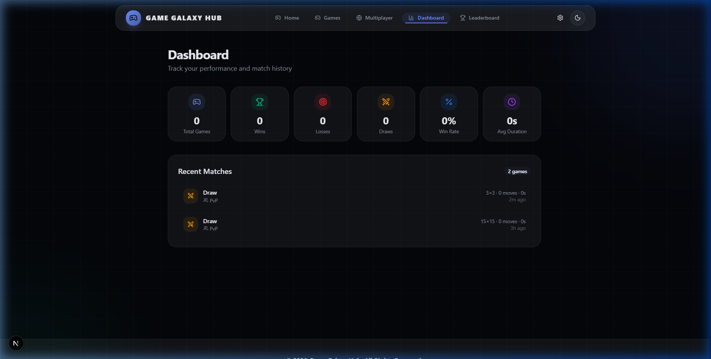
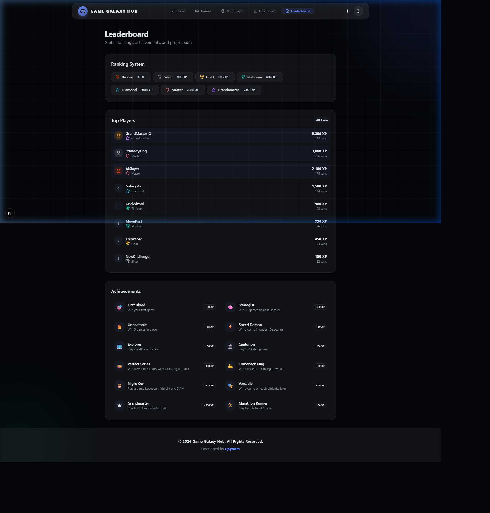

# 🎮 Game Galaxy Hub

> **The Ultimate Multi-Game Experience** — Play Tic-Tac-Toe, Ludo, and more from one premium gaming hub.

A production-ready, real-time multiplayer board game platform built with **Next.js 16**, **TypeScript**, **Socket.IO**, and **Framer Motion**, featuring smart AI opponents, a live in-game chat system, persistent analytics, and a stunning glassmorphism dark-mode UI.

[](https://nextjs.org/)
[](https://www.typescriptlang.org/)
[](https://socket.io/)
[](https://tailwindcss.com/)
[](https://www.framer.com/motion/)
[](LICENSE)

🌐 **Live Demo:** https://game-galaxy-hub.vercel.app  
📂 **Repository:** https://github.com/test-Ois/game-galaxy-hub

---

## 📷 Screenshots

### Home Page
<div align="center">
  
</div>

### Game Library
<div align="center">
  
</div>

### Tic-Tac-Toe Gameplay & Online Lobby
<div align="center">
  
  
</div>

### Analytics Dashboard & Leaderboard
<div align="center">
  
  
</div>

---

## ✨ Features

### 🎯 Games
| Game | Mode | Status |
|---|---|---|
| **Tic-Tac-Toe** | Offline vs AI · Local PvP · Online Multiplayer | ✅ Live |
| **Ludo Arena** | Online Multiplayer (2–4 players) | ✅ Live |
| **Snake** | Solo Arcade | 🔜 Coming Soon |
| **Memory Match** | Solo Challenge | 🔜 Coming Soon |
| **Rock Paper Scissors** | Quick-play Rounds | 🔜 Coming Soon |

### 🌐 Real-Time Multiplayer
- **Room Code System** — Create a room, share the 6-character code, and friends join instantly.
- **Socket.IO Sync** — Game moves, turn updates, and room state sync in real time across all connected players.
- **Reconnection Support** — Tab-unique player identity via `sessionStorage` survives page refreshes; players rejoin their room automatically.
- **Live In-Game Chat** — Glassmorphic slide-out chat drawer with emoji picker, typing indicators, and system event messages (join / leave / game events).
- **Voice Chat (WebRTC)** — Peer-to-peer voice rooms with mic toggle, speaker control, and connection status indicators.

### 🤖 AI Opponents (Tic-Tac-Toe)
- **Easy** — Random empty-cell selection.
- **Medium** — Heuristic evaluation: wins immediately, blocks threats, prefers center and corners.
- **Hard** — Full Minimax with alpha-beta pruning, depth-bounded per grid size (9 for 3×3, 4 for 4×4, 3 for 5×5) for zero-latency responses.

### 📊 Analytics & Progression
- **Dashboard** — Win/loss/draw rates, win rate trend chart, average match duration, recent match log (last 50 games), and performance breakdowns by mode and difficulty.
- **Leaderboard** — XP-based ranking system with 10 milestone tiers (from Rookie to Grandmaster), personal rank tracking, and local multiplayer standings.

### 🎨 Premium UI / UX
- **Dark Mode Gaming Theme** — Deep navy and charcoal palette with vibrant neon-primary accents.
- **Glassmorphism Effects** — Translucent frosted card components using `backdrop-blur` and layered glass utilities.
- **Framer Motion Animations** — Page transitions, board entry staggering, win-line SVG path drawing, game-over confetti, and message slide-ins.
- **Responsive Design** — Mobile-first layout; fully usable on phones, tablets, and desktops.
- **Web Audio Synthesizer** — Low-latency synth tones for moves, wins, and errors (with mute toggle in settings).
- **PWA Ready** — Installable as a Progressive Web App with offline fallback page and manifest icons.

### 🎮 Gameplay Extras
- **Dynamic Grid Sizes** — 3×3, 4×4, and 5×5 Tic-Tac-Toe boards with per-size win-length rules.
- **Best-Of Series Mode** — Best-of-1, 3, or 5 series with round tracking and series champions.
- **Move History** — Full undo/redo stack with board replay.
- **Ludo Turn Timers** — Auto-roll after 30-second timeout to keep games moving.

---

## 🛠️ Tech Stack

| Layer | Technology | Version | Purpose |
|---|---|---|---|
| **Framework** | Next.js (App Router) | 16.2 | Routing, SSR, custom server |
| **Language** | TypeScript | 5.x | Type safety across the stack |
| **Styling** | Tailwind CSS | 4.x | CSS variable design tokens |
| **Components** | Base UI + Shadcn/UI | Latest | Accessible unstyled primitives |
| **State** | Zustand | 5.x | Global game & settings state |
| **Animations** | Framer Motion | 12.x | Motion, layout, drag, SVG |
| **Realtime** | Socket.IO | 4.x | WebSocket multiplayer server |
| **Voice** | WebRTC (Mesh) | Native | Peer-to-peer voice rooms |
| **Audio** | Web Audio API | Native | Synthesizer sound effects |
| **Confetti** | canvas-confetti | 1.9 | Victory particle celebrations |
| **Icons** | Lucide React | 1.x | SVG icon library |

---

## 🏗️ Project Structure

```
game-galaxy-hub/
├── server.js                    # Custom Next.js + Socket.IO server
├── package.json
├── public/
│   ├── screenshots/             # README & demo screenshots
│   ├── manifest.json            # PWA manifest
│   └── sw.js                    # Service worker (offline support)
└── src/
    ├── app/                     # Next.js App Router pages
    │   ├── page.tsx             # Home / landing hero
    │   ├── layout.tsx           # Root shell (Navbar, Footer, PWA prompt)
    │   ├── globals.css          # Design tokens, glass utilities, custom scrollbar
    │   ├── games/               # Game library / catalog page
    │   ├── online/              # Multiplayer lobby (create / join room)
    │   ├── play/
    │   │   ├── page.tsx         # Tic-Tac-Toe game page (offline)
    │   │   ├── online/[roomId]/ # Tic-Tac-Toe online room page
    │   │   ├── tictactoe/       # Extended TTT offline variants
    │   │   └── ludo/
    │   │       ├── offline/     # Ludo local play page
    │   │       └── [roomId]/    # Ludo online room page
    │   ├── dashboard/           # Analytics & match history
    │   └── leaderboard/         # XP rankings & tiers
    ├── components/
    │   ├── game/
    │   │   ├── Board.tsx        # Tic-Tac-Toe board grid
    │   │   ├── Cell.tsx         # Animated board cell
    │   │   ├── ChatPanel.tsx    # Slide-out real-time chat drawer
    │   │   ├── GameCard.tsx     # Game library card component
    │   │   ├── GameControls.tsx # Mode/difficulty/series selectors
    │   │   ├── GameDetailsModal.tsx
    │   │   ├── GameOverModal.tsx
    │   │   └── Scoreboard.tsx
    │   ├── layout/
    │   │   ├── Navbar.tsx       # Fixed top nav with settings & theme toggle
    │   │   ├── Footer.tsx       # Site footer
    │   │   ├── SettingsModal.tsx # Sound, theme, voice preferences
    │   │   ├── PWAInstallPrompt.tsx
    │   │   └── ThemeToggle.tsx
    │   ├── providers/           # next-themes ThemeProvider
    │   └── ui/                  # Radix-based primitives (button, badge, dialog, select…)
    ├── hooks/
    │   ├── useOnlineSocket.ts   # Socket.IO connection, room & game events
    │   ├── useVoiceChat.ts      # WebRTC mesh voice chat
    │   ├── useSound.ts          # Web Audio synth tones
    │   └── useTimer.ts          # Match stopwatch
    ├── lib/
    │   ├── game/
    │   │   ├── engine.ts        # Win/draw detection, pattern generation
    │   │   ├── ai.ts            # Easy / Medium / Hard AI (minimax + alpha-beta)
    │   │   ├── types.ts         # Shared TypeScript interfaces
    │   │   ├── config.ts        # Game configuration constants
    │   │   └── constants.ts     # Board/grid constants
    │   └── utils.ts             # Tailwind cn() helper
    └── stores/
        ├── gameStore.ts         # Zustand: board, scores, online room, chat, ludo state
        └── settingsStore.ts     # Zustand: sound, voice, theme preferences
```

---

## 🌐 Multiplayer System

Game Galaxy Hub uses a custom **Node.js + Socket.IO** server that Next.js hands off to at runtime.

### Room Lifecycle

```
Player A                         Server                         Player B
   │── createRoom(name, opts) ──▶│                                 │
   │◀── roomCreated(room) ───────│                                 │
   │                             │◀────── joinRoom(roomId) ────────│
   │◀── roomUpdated(room) ───────│── roomJoined(room) ────────────▶│
   │              [ Both players now in lobby ]                    │
   │── startGame() ─────────────▶│── roomUpdated(status=playing) ─▶│
   │              [ Game begins, turns sync in real time ]         │
   │── makeMove(index) ──────────▶│── roomUpdated(newBoard) ───────▶│
```

### Key Events

| Client → Server | Description |
|---|---|
| `createRoom` | Host creates a room with game type, size, and series settings |
| `joinRoom` | Guest joins using the 6-character Room ID |
| `rejoinRoom` | Reconnect to existing room after page refresh |
| `makeMove` | Submit a Tic-Tac-Toe board cell index |
| `ludoRollDice` | Roll dice for current Ludo turn |
| `ludoMoveToken` | Move a Ludo token to a new position |
| `sendMessage` | Send a chat message to the room |
| `typingState` | Broadcast typing indicator to opponents |
| `requestRematch` | Vote for a rematch after game ends |
| `leaveRoom` | Gracefully exit and clean up room state |

| Server → Client | Description |
|---|---|
| `roomCreated` | Confirms room creation, returns room object |
| `roomJoined` | Confirms guest joined successfully |
| `roomUpdated` | Full room state sync after every action |
| `newMessage` | Broadcast incoming chat message |
| `typingStateUpdated` | Relay typing indicator to other players |
| `errorMsg` | Validation error (full room, invalid ID, etc.) |
| `rejoinedRoomSuccess` | Reconnection confirmed |
| `rejoinFailed` | Reconnection failed — room no longer exists |

### Player Identity

Each browser **tab** gets a unique `playerId` stored in `sessionStorage` (`ggh-player-id`). This prevents player ID collisions when testing with two tabs in the same browser, and preserves identity across page refreshes within the same tab.

---

## 🚀 Getting Started

### Prerequisites

- **Node.js** 18+
- **npm** 9+

### Installation

```bash
# Clone the repository
git clone https://github.com/test-Ois/game-galaxy-hub.git
cd game-galaxy-hub

# Install dependencies
npm install

# Start the development server (Next.js + Socket.IO)
npm run dev

# Open http://localhost:3000
```

> **Important:** Always use `npm run dev` (not `next dev`) — the custom `server.js` starts both Next.js and the Socket.IO server on the same port.

---

## 📦 Available Scripts

| Command | Action |
|---|---|
| `npm run dev` | Start Next.js + Socket.IO dev server with hot-reload |
| `npm run build` | Compile optimized production bundle |
| `npm run start` | Run production server (`node server.js --production`) |
| `npm run lint` | Run ESLint checks |
| `npm run format` | Format source files with Prettier |

---

## ☁️ Deployment

### Vercel (Recommended)

Because Game Galaxy Hub uses a **custom Node.js server** with Socket.IO, it must be deployed as a **Node.js server app**, not as a static export.

1. Push your repository to GitHub.
2. Import the repository at [vercel.com](https://vercel.com).
3. Set the **Output Directory** to `.next` and the **Install Command** to `npm install`.
4. Set the **Build Command** to `npm run build`.
5. Set the **Start Command** (under "Other" framework preset) to `node server.js --production`.
6. Add environment variables (see below).
7. Click **Deploy**.

### Environment Variables

Create a `.env.local` for local development, or set these in your Vercel project settings:

```bash
# Optional — defaults to window.location.origin at runtime
NEXT_PUBLIC_SERVER_URL=https://your-app.vercel.app

# Port for the custom server (Vercel ignores this; use for self-hosting)
PORT=3000
```

### Self-Hosting

```bash
# Build the production bundle
npm run build

# Start the production server
npm run start
# Listens on PORT (default 3000)
```

---

## 🎮 How to Play Multiplayer

1. Navigate to **Online** from the navbar.
2. **Host**: Enter a nickname → choose game (Tic-Tac-Toe or Ludo) → click **Create Room**.
3. Share the **6-character Room ID** with your friend.
4. **Guest**: Enter their nickname → paste the Room ID → click **Join Room**.
5. Both players appear in the lobby. The host can start the game.
6. Open the 💬 **Chat** icon in-game to send messages in real time.
7. Use the 🎤 **Mic** button to enable WebRTC voice chat.

---

## 👤 Author

**Qayoom Akhtar**  
*Software Engineer · Full Stack Developer · AI Enthusiast*

- **GitHub**: [@test-Ois](https://github.com/test-Ois)
- **Email**: [qayoomakhtar72@gmail.com](mailto:qayoomakhtar72@gmail.com)

---

## 📄 License

This project is licensed under the [MIT License](LICENSE).

---

<div align="center">
  <sub>Built with ❤️ using Next.js, Socket.IO & Framer Motion · © 2026 Game Galaxy Hub</sub>
</div>
