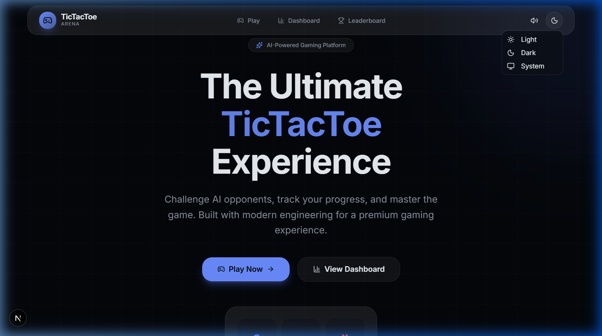
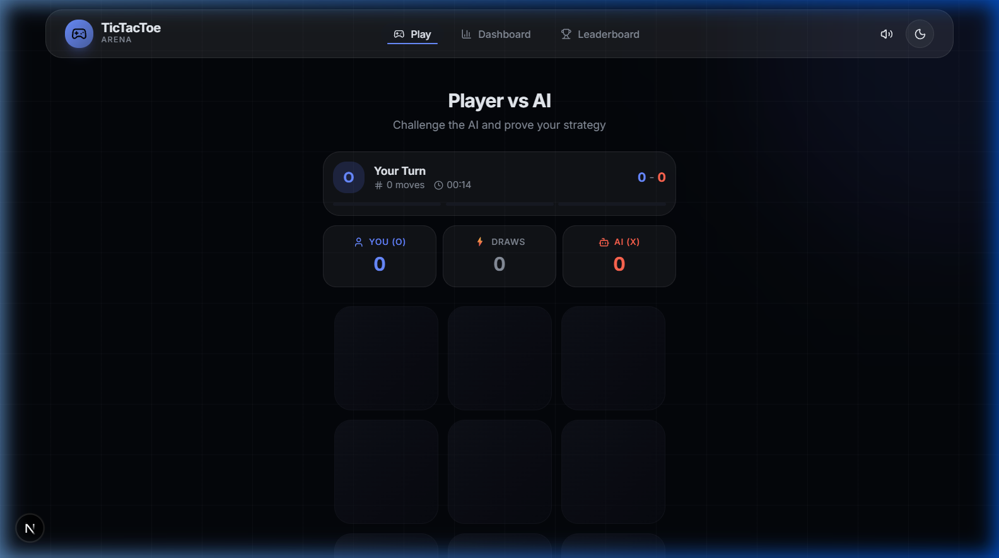
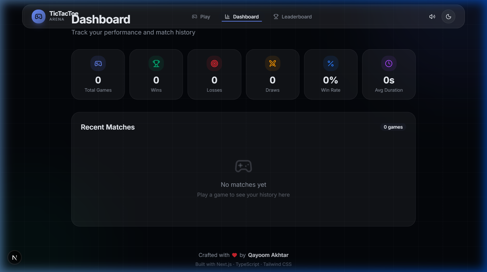
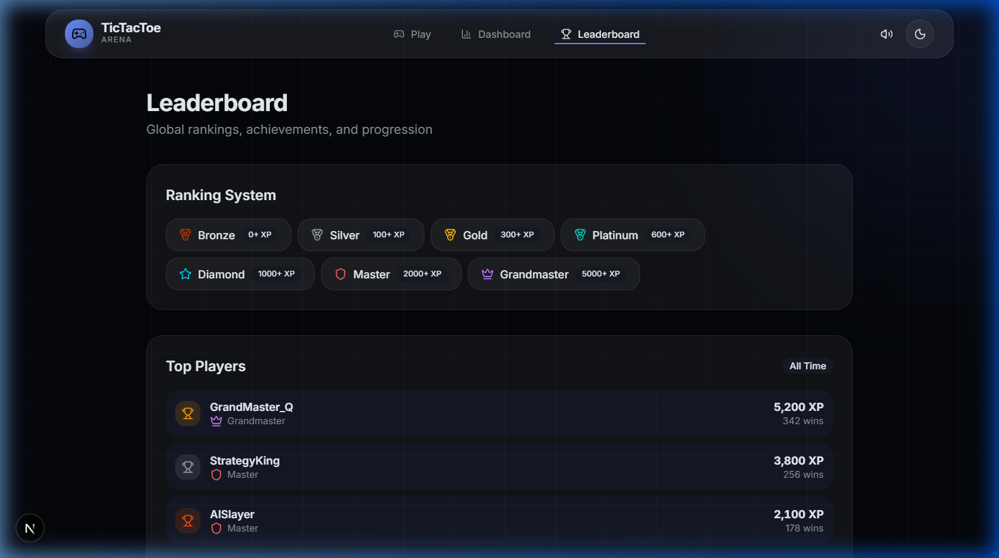

# 🎮 TicTacToe Arena

A high-performance, responsive Tic-Tac-Toe web application featuring an offline heuristic and minimax AI game solver, local multiplayer, best-of-series tracker, client-persistent analytics dashboard, and a premium light/dark glassmorphism design system.

---

## 📷 Screenshots

### Landing Page & Gameplay
<div align="center">
  
  
</div>

### Analytics Dashboard & Leaderboard
<div align="center">
  
  
</div>

---

## ✨ Features

- **Heuristic & Minimax AI Opponents**:
  - **Easy**: Selects randomly from empty board coordinates.
  - **Medium**: Evaluates board states using heuristics (prioritizes immediate wins, blocking opponent lines, securing center/corner cells).
  - **Hard**: Implements a minimax solver with alpha-beta pruning. Optimized with depth-bounds (9 for 3×3, 4 for 4×4, 3 for 5×5) to ensure zero latency computations.
- **Local PvP Mode**: Turn-based multiplayer matches on the same device.
- **Dynamic Grid Sizes**: Play on 3×3 (3-in-a-row to win), 4×4 (4-in-a-row to win), or 5×5 (4-in-a-row to win) boards.
- **Round Series Matches**: Supports best-of-1, best-of-3, or best-of-5 round series with round progress bars.
- **Board Undo/Redo**: Complete game history stack traversal for moving backwards/forwards.
- **Analytics & History Logs**: Client-side match history tracker (persisting last 50 games) and analytics dashboard displaying wins, losses, draws, win rates, and average match duration.
- **Audio Synthesizer**: Low-latency synth sound notifications using the Web Audio API (with navbar mute toggle).
- **Premium UI design**: Frosted glassmorphism themes including Dark mode and a custom mint-green (`#CAF1DE`) design system.

---

## 🛠️ Tech Stack

| Component | Technology | Description |
|---|---|---|
| **Framework** | Next.js 16 (App Router) | Core page routing and layout structure |
| **Language** | TypeScript | Strong typing and compiler safety |
| **Styling** | Tailwind CSS v4 | CSS variable theme tokens |
| **Components** | Radix Primitives + Shadcn UI | Accessible, unstyled UI component structures |
| **State** | Zustand + Persist | Client state persistence via `localStorage` |
| **Animations** | Framer Motion | Path-drawn SVG marks and fluid page transitions |
| **Audio** | Web Audio API | Synth-generated notification beeps |
| **Effects** | canvas-confetti | Victory celebration visual particles |

---

## 🏗️ Project Structure

```
src/
├── app/                     # Page routing structure
│   ├── dashboard/page.tsx   # Statistics and match logs panel
│   ├── leaderboard/page.tsx # Rank milestones and rankings table
│   ├── play/page.tsx        # Grid gameplay layout
│   ├── globals.css          # Design tokens and custom theme layers
│   ├── layout.tsx           # Metadata configurations and shell
│   └── page.tsx             # Landing hero and features listing
├── components/
│   ├── game/                # Game-specific components (Board, Cell, GameControls, Scoreboard)
│   ├── layout/              # Layout structural components (Navbar, Footer, ThemeToggle)
│   ├── providers/           # Theme provider shell
│   └── ui/                  # Component primitives (button, badge, dialog, select, tooltip)
├── hooks/                   # Custom hooks
│   ├── useSound.ts          # Synthesizer tone triggers
│   └── useTimer.ts          # Game stopwatch clock
├── lib/
│   ├── game/                # Core engines (engine.ts, ai.ts, types.ts, constants.ts)
│   └── utils.ts             # Tailwind class merging helpers
└── stores/                  # Zustand stores (gameStore, settingsStore)
```

---

## 🚀 Getting Started

### Prerequisites

- **Node.js** 18+
- **npm** 9+

### Installation

```bash
# Clone the repository
git clone https://github.com/test-Ois/tictactoe-arena.git
cd tictactoe-arena

# Install dependencies
npm install

# Start development server
npm run dev

# Open browser at http://localhost:3000
```

### Environment Settings
Copy the optional environment variables to set the base URL:
```bash
cp .env.example .env.local
```

---

## 📦 Available Scripts

| Command | Action |
|---|---|
| `npm run dev` | Launch local hot-reload dev server |
| `npm run build` | Compile optimized production bundle |
| `npm run start` | Start production server locally |
| `npm run lint` | Run ESLint validation checks |
| `npm run format` | Run Prettier code formatting |

---

## ☁️ Deployment

This project builds as a completely static site and can be deployed directly to Vercel with zero runtime configuration:

1. Push your repository code to GitHub.
2. Import the repository in [Vercel](https://vercel.com).
3. Vercel will auto-detect Next.js; click **Deploy**.

---

## 👤 Author

**Qayoom Akhtar**  
*Software Engineer | Full Stack Developer | AI Enthusiast*

- **GitHub**: [@test-Ois](https://github.com/test-Ois)
- **Email**: [qayoomakhtar72@gmail.com](mailto:qayoomakhtar72@gmail.com)
