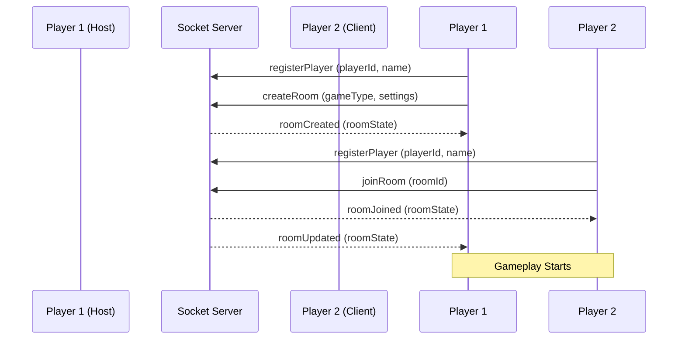

# Real-Time Socket.io Flow & Signaling

This document details the real-time communication architecture of **Game Galaxy Hub**, specifying the socket connections, event names, payloads, and signaling flows.

## Socket Connection Lifecycle

1. **Instantiation**: The client requests a connection to the socket server using the `getSocket()` helper defined in `@/shared/services/socket/socketClient`.
2. **Configuration**: The socket options are initialized using centralized constants in `socketConstants.ts`:
   * `autoConnect: true`
   * `reconnectionAttempts: 5`
   * `reconnectionDelay: 1000`
3. **Identification**: Once connected, the client registers itself with a unique player ID (e.g. `player-xxxx`) using the `registerPlayer` event.

---

## Matchmaking & Room Management Flow

The diagram below outlines the standard flow of creating, joining, and updating rooms:

### Event Contracts

#### Client-to-Server Events

* **`registerPlayer`**: Sent immediately after connection to bind the socket session to a persistent player ID.
  * Payload: `{ playerId: string, name: string }`
* **`createRoom`**: Initiated by a host player.
  * Payload: `{ gameType: "tictactoe" | "ludo", settings: { boardSize, seriesMode } }`
* **`joinRoom`**: Sent by a player attempting to enter an active match.
  * Payload: `{ roomId: string, name: string }`
* **`leaveRoom`**: Sent when a user explicitly exits a game lobby back to the main menu.
  * Payload: `{ roomId: string }`

#### Server-to-Client Broadcasts

* **`roomCreated`**: Emitted to the host confirming the creation of the room.
  * Payload: `OnlineRoom` state object.
* **`roomJoined`**: Emitted to the entering player confirming join success.
  * Payload: `OnlineRoom` state object.
* **`roomUpdated`**: Emitted to all players in a room whenever there is a membership change, status update, or rematch request.
  * Payload: `OnlineRoom` state object.
* **`errorMsg`**: Emitted when a room is full, doesn't exist, or an invalid move is rejected.
  * Payload: `{ message: string }`

---

## Gameplay Synchronization Flow

Once status changes to `"playing"`, game events synchronize turns, moves, and results:

### Tic-Tac-Toe Move Sync
1. Client emits **`makeMove`** with cell index: `{ roomId: string, index: number }`.
2. Server validates turn and updates board matrix.
3. Server broadcasts **`roomUpdated`** with the updated grid and current player token.

### Ludo Actions Sync
* **`ludoToggleReady`**: Emitted in the lobby to toggle host/client ready status: `{ roomId: string }`.
* **`ludoStartGame`**: Emitted by the host to move the room status from `"waiting"` to `"playing"` once players are ready.
* **`ludoRollDice`**: Emitted by the current player to roll the dice. The server rolls a random number (1 to 6) and broadcasts the result.
* **`ludoMoveToken`**: Emitted by the player after rolling to select which token to advance.
  * Payload: `{ roomId: string, tokenIndex: number }`

---

## WebRTC Voice Signaling

The Socket.io channel acts as the signaling mediator for establishing WebRTC peer-to-peer audio connections:

1. **Lobby Join**: When a room is created or joined, players broadcast their microphone states.
2. **Signaling Exchange**:
   * **`webrtc-offer`**: Client sends SDP offer to another peer socket ID.
   * **`webrtc-answer`**: Peer returns SDP answer.
   * **`webrtc-ice`**: Peers exchange network routing candidates.
3. **Audio Stream**: Once signaling is complete, the peer-to-peer RTCPeerConnection binds the audio tracks directly, bypassing the Socket.io server.

---

## Server Reconnection & Sweeping Logic

* **Reconnection Buffer**: When a socket disconnects abruptly, the backend room manager holds the player state for 15 seconds. If the player emits **`rejoinRoom`** with their registered `playerId` and `roomId` within that window, they are rebinded to their slot.
* **Lobby Sweeper**: An automated timer runs every 60 seconds on the server. Any room with zero connected players for more than 5 minutes is purged from memory to prevent memory leaks.
